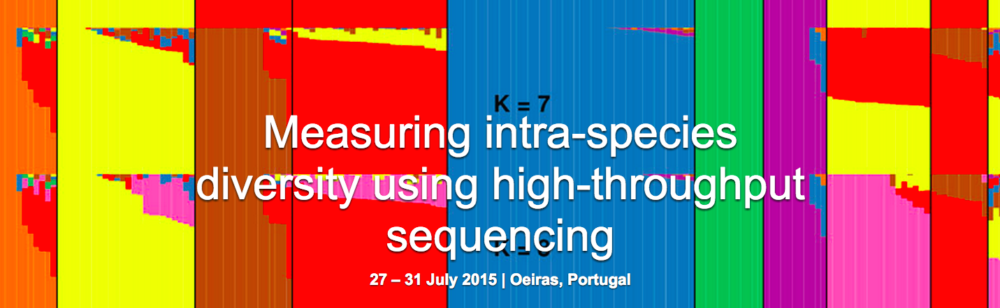

.. embo-diversity-tutorial documentation master file, created by
   sphinx-quickstart on Tue Jul 28 10:12:57 2015.
   You can adapt this file completely to your liking, but it should at least
   contain the root `toctree` directive.

Estimating the diversity of immune repertoires
==============================================

This tutorial covers processing and post-analysis of 
T-cell receptor (TCR) repertoire sequencing (RepSeq) data. 
General strategy for such data would be to de-multiplex samples
and then map Variable (V), Diversity (D) and Joining (J) segments that 
are rearranged to form a mature TCR sequence. The complementarity
determining region 3 (CDR3), a hypervariable TCR part that 
defines antigen specificity containing V-(D)-J junction, is then extracted.
V, J and CDR3 regions are further assembled into clonotypes.

Datasets that are discussed here are amplicon libraries of 
TCR beta chain performed using 5'RACE that introduces 
unique molecular identifiers (UMI), short 12-bp tags of 
random nucleotides. Those are introduced at cDNA synthesis 
step and allow to trace reads back to their original cDNA molecules 
thus correcting for sequencing errors and allowing to count the 
number of starting molecules.

The following software tools are used for data processing and analysis:

-  MIGEC for de-multiplexing data UMI-based error correction,
   mapping V(D)J segments
-  MITCR for V(D)J mapping and frequency-based error correction
-  VDJtools for computing diversity estimates and rarefaction 
   analysis
   
Those tools are developed specifically for analysis of RepSeq, 
although some modules of MIGEC can be applied to broad range of 
UMI-tagged data.

The repository https://github.com/mikessh/repseq-tutorial 
contains software binaries, datasets and shell scripts listing 
all commands used in this tutorial. Some plotting and statistics 
is done in R.

Table of Contents
-----------------

.. toctree::
   :maxdepth: 2
   
   prerequisites
   part1
   part2
   part3
