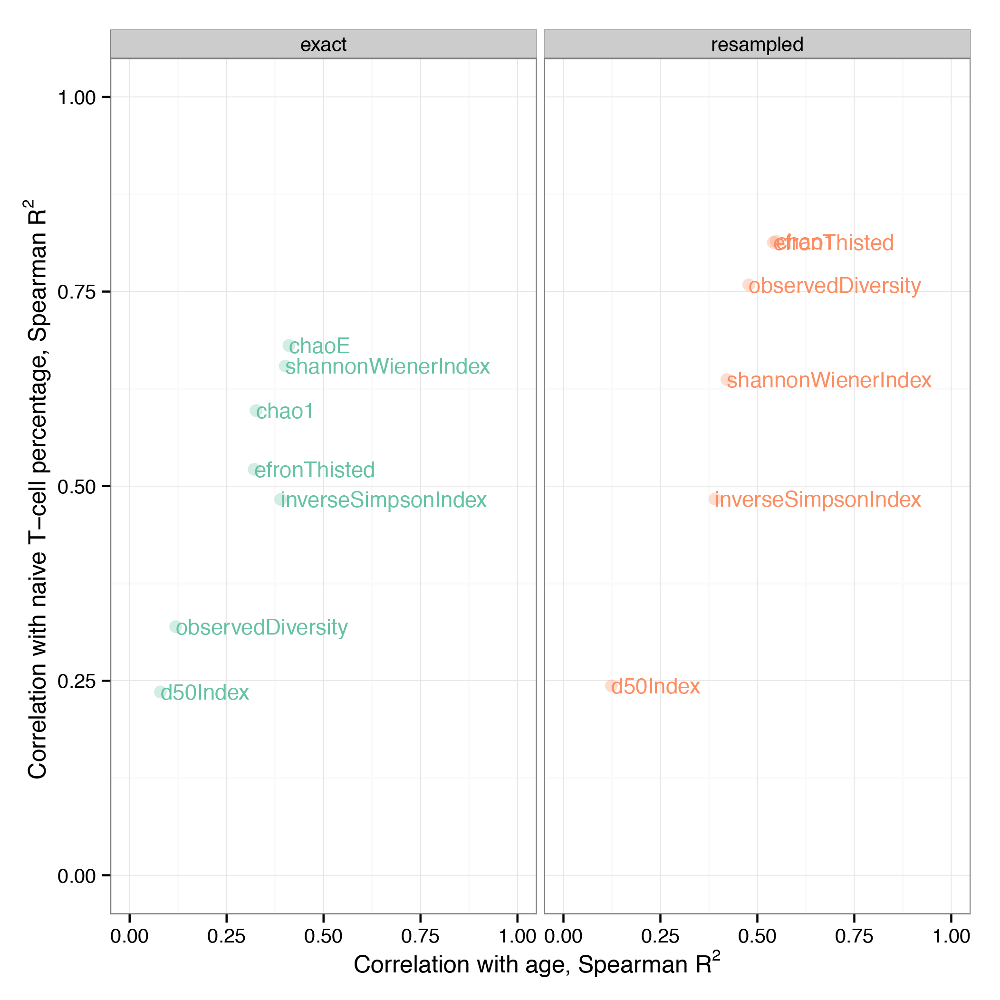

Part II: Comparing diversity estimates
--------------------------------------

Datasets to be analyzed in this section can be found 
in ``task2/`` folder. There are 39 preprocessed clonotype 
tables for TRB repertoires of healthy donors of 
various ages. This folder also contains ``metadata.txt`` 
file with the age and percent of naive T-cells for each 
donor.

Estimating diversity
^^^^^^^^^^^^^^^^^^^^

Corresponding routine of VDJtools framework is called CalcDiversityStats. The list of 
diversity estimates that can be computed using this
routine is given here http://vdjtools-doc.readthedocs.org/en/latest/diversity.html#calcdiversitystats

.. code-block:: bash

    $VDJTOOLS CalcDiversityStats -m metadata.txt .
    
This will generate two files with diversity estimates, suffixed 
as ``.exact.txt`` and ``.resampled.txt``. The latter contains estimates 
computed on datasets down-sampled to the size of the smallest one.

Plotting and comparing
^^^^^^^^^^^^^^^^^^^^^^

The following R script will generate two plots comparing 
the performance of various diversity estimates computed for 
original and resampled data. The comparison is performed 
based on Spearman correlation

.. code-block:: R

    require(ggplot2)
    
    # load data tables
    df.e <- read.table("diversity.strict.exact.txt", header=T, comment="", sep="\t")
    df.r <- read.table("diversity.strict.resampled.txt", header=T, comment="", sep="\t")
    
    # prepare a table to store correlation coefficients
    measures <- c("observedDiversity", "chaoE", "efronThisted", "chao1", "d50Index", "shannonWeinerIndex", "inverseSimpsonIndex")
    methods <- c("exact", "resampled")
    
    g <- as.data.frame(expand.grid(measures, methods))
    colnames(g) <- c("measure", "method")
    g[, "age"] <- numeric(nrow(g))
    g[, "naive"] <- numeric(nrow(g))
    
    # fill table
    for (i in 1:nrow(g)) {
      measure <- as.character(g[i,1])
      method <- as.character(g[i,2])
      
      if (method == "exact") {
        df <- df.e
      } else {
        df <- df.r
      }
      
      y <- as.numeric(as.character(df[,paste(measure, "mean", sep="_")]))  
      
      x <- as.numeric(as.character(df[,"age"]))  
      g[i, 3] <- cor(x, y, method="spearman") ^ 2
      x <- as.numeric(as.character(df[,"naive"]))  
      g[i, 4] <- cor(x, y, method="spearman") ^ 2
    }
    
    # plot results
    pdf("measure_comparison.pdf")
    ggplot(g, aes(x=age, y=naive, color=method, label=measure)) +
      geom_point(size=3, alpha=0.3) + geom_text(cex=4, hjust=0) +
      scale_x_continuous(name = bquote('Correlation with age, Spearman '*R^2*' '), limits=c(0,1)) + 
      scale_y_continuous(name = bquote('Correlation with naive T-cell percentage, Spearman '*R^2*' '), limits=c(0,1)) +
      scale_color_brewer(palette="Set2") +
      facet_grid(~method) +
      theme_bw()+theme(legend.position="none")
    dev.off()
    
.. important::
    
    Headers in VDJtools output are marked with **#**, so we need to specify ``comment=""`` 
    when loading the data table in R.
     
.. note:: 

    We use Spearman correlation coefficient, as the distribution for 
    some measures like lower bound total diversity estimates is highly 
    skewed.

Expected results
^^^^^^^^^^^^^^^^
   
